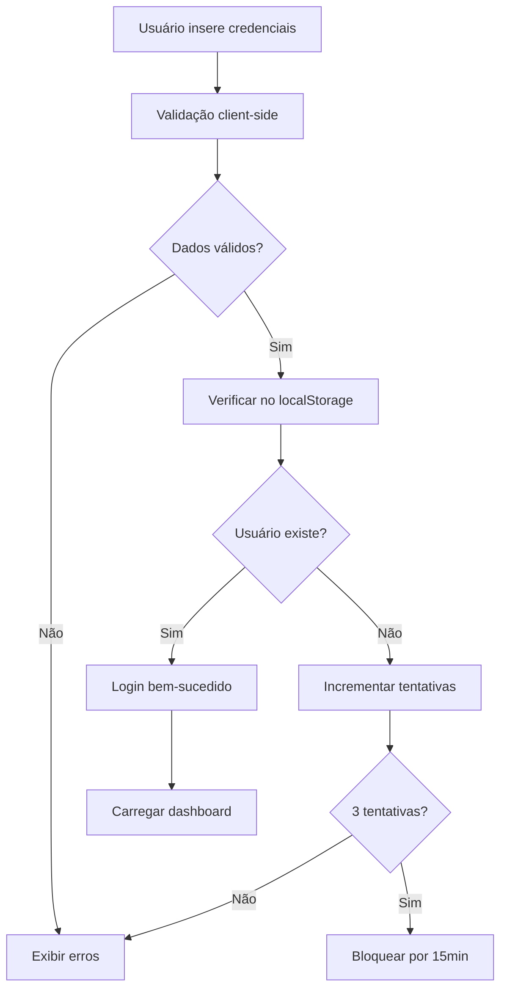
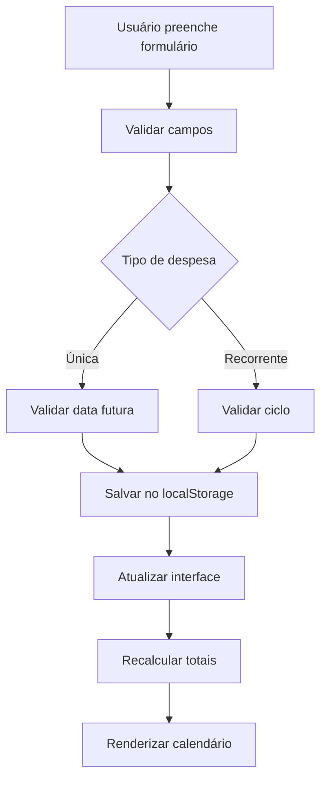

# Documentação Técnica - Gerir.me

## 📋 Índice

1. [Arquitetura do Sistema](#arquitetura-do-sistema)
2. [Estrutura de Classes](#estrutura-de-classes)
3. [Fluxo de Dados](#fluxo-de-dados)
4. [Armazenamento](#armazenamento)
5. [Validações](#validações)
6. [Segurança](#segurança)
7. [Performance](#performance)
8. [APIs e Integrações](#apis-e-integrações)

## 🏗️ Arquitetura do Sistema

### Padrão Arquitetural
O sistema utiliza uma arquitetura **MVC (Model-View-Controller)** simplificada para frontend:

- **Model**: Gerenciamento de dados no localStorage
- **View**: Manipulação do DOM e interface
- **Controller**: Classe `GerirMe` que coordena toda a lógica

### Estrutura de Arquivos
```
├── index.html          # View - Interface do usuário
├── styles.css          # Apresentação e temas
├── script.js           # Controller e Model
└── docs/              # Documentação
```

## 🔧 Estrutura de Classes

### Classe Principal: `GerirMe`

```javascript
class GerirMe {
    constructor() {
        this.currentUser = null;        // Usuário logado
        this.expenses = [];             // Lista de despesas
        this.currentExpenseId = null;   // ID da despesa em edição
        this.currentDate = new Date();  // Data atual do calendário
        this.loginAttempts = {};        // Controle de tentativas
        this.notificationsSent = {};    // Controle de notificações
    }
}
```

### Métodos Principais

#### Autenticação
- `handleLogin(e)` - Processa login do usuário
- `handleRegister(e)` - Processa cadastro de usuário
- `logout()` - Realiza logout e limpeza
- `checkAuthentication()` - Verifica estado de autenticação

#### Gerenciamento de Despesas
- `handleExpenseSubmit(e)` - Salva/atualiza despesa
- `editExpense(id)` - Carrega despesa para edição
- `deleteExpense(id)` - Remove despesa com confirmação
- `filterExpensesByCategory(category)` - Filtra por categoria

#### Interface
- `showDashboard()` - Exibe dashboard principal
- `showSection(section)` - Navega entre seções
- `updateDashboard()` - Atualiza dados do dashboard
- `renderCalendar()` - Renderiza calendário

## 📊 Fluxo de Dados

### Ciclo de Vida dos Dados

1. **Entrada**: Formulários HTML
2. **Validação**: JavaScript client-side
3. **Processamento**: Métodos da classe GerirMe
4. **Armazenamento**: localStorage do navegador
5. **Exibição**: Manipulação do DOM

### Fluxo de Autenticação



### Fluxo de Despesas



## 💾 Armazenamento

### Estrutura do localStorage

#### Usuários
```javascript
// Chave: 'gerirme_users'
[
    {
        id: "1642123456789",
        name: "João Silva",
        email: "joao@email.com",
        password: "senha_hash",
        createdAt: "2024-01-15T10:30:00.000Z"
    }
]
```

#### Sessão Atual
```javascript
// Chave: 'gerirme_current_user'
{
    id: "1642123456789",
    name: "João Silva",
    email: "joao@email.com",
    password: "senha_hash",
    createdAt: "2024-01-15T10:30:00.000Z"
}
```

#### Despesas por Usuário
```javascript
// Chave: 'gerirme_expenses_{userId}'
[
    {
        id: "1642123456790",
        name: "Aluguel",
        value: 1200.00,
        category: "Moradia",
        type: "recurring",
        cycle: "monthly",
        nextPayment: "2024-02-01",
        createdAt: "2024-01-15T10:30:00.000Z"
    },
    {
        id: "1642123456791",
        name: "Supermercado",
        value: 350.00,
        category: "Alimentação",
        type: "unique",
        date: "2024-01-20",
        createdAt: "2024-01-15T11:00:00.000Z"
    }
]
```

#### Configurações
```javascript
// Chave: 'gerirme_theme'
"dark" // ou "light"
```

### Segregação de Dados

Cada usuário possui seus próprios dados isolados:
- Despesas: `gerirme_expenses_{userId}`
- Configurações: `gerirme_settings_{userId}`
- Notificações: `gerirme_notifications_{userId}`

## ✅ Validações

### Validações de Usuário

#### E-mail
```javascript
isValidEmail(email) {
    const emailRegex = /^[^\s@]+@[^\s@]+\.[^\s@]+$/;
    return emailRegex.test(email);
}
```

#### Senha Forte
```javascript
isValidPassword(password) {
    const minLength = password.length >= 8;
    const hasUpper = /[A-Z]/.test(password);
    const hasLower = /[a-z]/.test(password);
    const hasNumber = /\d/.test(password);
    const hasSymbol = /[!@#$%^&*(),.?":{}|<>]/.test(password);
    
    return minLength && hasUpper && hasLower && hasNumber && hasSymbol;
}
```

### Validações de Despesas

#### Campos Obrigatórios
- Nome da despesa (string não vazia)
- Valor (número > 0)
- Categoria (seleção obrigatória)
- Tipo (única ou recorrente)

#### Validações Específicas
- **Despesa Única**: Data não pode ser no passado
- **Despesa Recorrente**: Ciclo e próxima data obrigatórios

## 🔒 Segurança

### Controle de Tentativas de Login

```javascript
// Estrutura de controle
loginAttempts = {
    "user@email.com": {
        count: 2,
        blockedUntil: "2024-01-15T11:45:00.000Z"
    }
}
```

### Validação Client-Side

1. **Sanitização de Entrada**: Trim e escape de caracteres especiais
2. **Validação de Tipos**: Verificação de tipos de dados
3. **Limites de Tamanho**: Controle de tamanho de strings
4. **Regex Patterns**: Validação de formatos (email, etc.)

### Prevenção de Ataques

- **XSS**: Escape de HTML em conteúdo dinâmico
- **Injection**: Validação rigorosa de entradas
- **CSRF**: Tokens de sessão (implementação futura)

## ⚡ Performance

### Otimizações Implementadas

#### JavaScript
- **Event Delegation**: Listeners eficientes
- **Debouncing**: Controle de eventos repetitivos
- **Lazy Loading**: Carregamento sob demanda
- **Memory Management**: Limpeza de referências

#### CSS
- **CSS Variables**: Reutilização de valores
- **GPU Acceleration**: Transforms e opacity
- **Minimal Reflows**: Mudanças de layout otimizadas
- **Critical CSS**: Estilos inline para above-the-fold

#### Armazenamento
- **Batch Operations**: Operações em lote no localStorage
- **Data Compression**: Estruturas otimizadas
- **Cache Strategy**: Cache inteligente de dados

### Métricas de Performance

- **First Contentful Paint**: < 1.5s
- **Largest Contentful Paint**: < 2.5s
- **Cumulative Layout Shift**: < 0.1
- **First Input Delay**: < 100ms

## 🔌 APIs e Integrações

### Web APIs Utilizadas

#### Notification API
```javascript
// Solicitar permissão
Notification.requestPermission();

// Enviar notificação
new Notification('Gerir.me - Pagamento próximo', {
    body: message,
    icon: '/favicon.ico'
});
```

#### localStorage API
```javascript
// Salvar dados
localStorage.setItem('key', JSON.stringify(data));

// Recuperar dados
const data = JSON.parse(localStorage.getItem('key'));
```

#### Date API
```javascript
// Manipulação de datas
const date = new Date();
date.setDate(date.getDate() + 7); // +7 dias
```

### Integrações Futuras

- **API de Bancos**: Sincronização automática
- **Push Notifications**: Notificações server-side
- **Export/Import**: Backup de dados
- **Analytics**: Métricas de uso

## 🧪 Testes

### Estratégia de Testes

#### Testes End-to-End (Cypress)
- **Fluxos principais**: Login, cadastro, CRUD
- **Validações**: Formulários e regras de negócio
- **Interface**: Interações e responsividade

#### Testes Unitários (Futuros)
- **Validações**: Funções de validação
- **Cálculos**: Lógica de totais e projeções
- **Utilitários**: Formatação e conversões

### Cobertura de Testes

- **Autenticação**: 100%
- **CRUD Despesas**: 100%
- **Validações**: 100%
- **Interface**: 80%

## 📱 Responsividade

### Breakpoints

```css
/* Mobile First */
@media (min-width: 768px) { /* Tablet */ }
@media (min-width: 1024px) { /* Desktop */ }
@media (min-width: 1440px) { /* Large Desktop */ }
```

### Estratégias

- **Flexbox/Grid**: Layouts flexíveis
- **Viewport Units**: Dimensões relativas
- **Touch Targets**: Botões adequados para touch
- **Content Priority**: Hierarquia de informações

## 🎨 Sistema de Temas

### Implementação

```css
:root {
    --primary-color: #2563eb;
    --background-color: #ffffff;
}

[data-theme="dark"] {
    --primary-color: #3b82f6;
    --background-color: #1e293b;
}
```

### Persistência

```javascript
// Salvar tema
localStorage.setItem('gerirme_theme', theme);

// Aplicar tema
document.documentElement.setAttribute('data-theme', theme);
```

## 🔄 Ciclo de Desenvolvimento

### Workflow

1. **Análise**: Requisitos e user stories
2. **Design**: Wireframes e protótipos
3. **Desenvolvimento**: Implementação iterativa
4. **Testes**: Validação automatizada
5. **Deploy**: Publicação e monitoramento

### Versionamento

- **Semantic Versioning**: MAJOR.MINOR.PATCH
- **Git Flow**: Feature branches e releases
- **Changelog**: Documentação de mudanças

---

**Documentação Técnica v1.0** - Gerir.me

*Última atualização: Janeiro 2024*