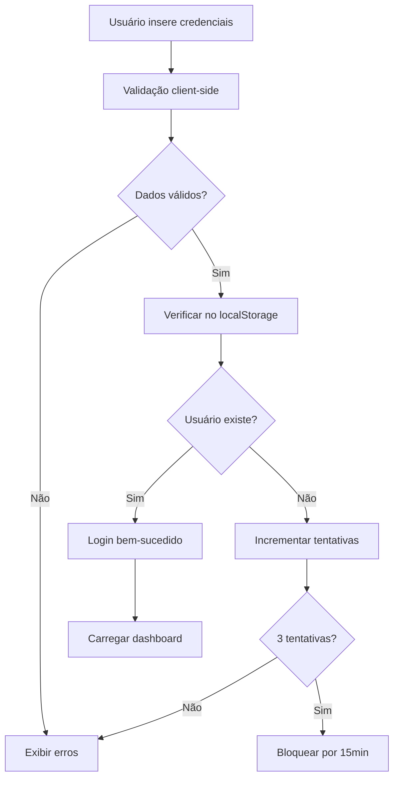
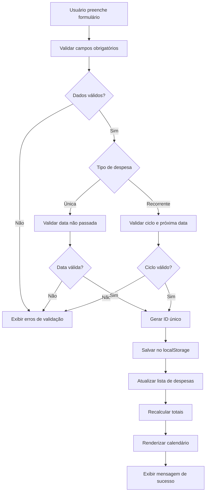

# Documentação Técnica - Gerir.me

## 📋 Índice

1. [Arquitetura do Sistema](#arquitetura-do-sistema)
2. [Estrutura de Classes](#estrutura-de-classes)
3. [Fluxo de Dados](#fluxo-de-dados)
4. [Armazenamento](#armazenamento)
5. [Validações](#validações)
6. [Segurança](#segurança)
7. [Performance](#performance)
8. [APIs e Integrações](#apis-e-integrações)

## 🏗️ Arquitetura do Sistema

### Padrão Arquitetural
O sistema utiliza uma arquitetura **MVC (Model-View-Controller)** simplificada para frontend:

- **Model**: Gerenciamento de dados no localStorage
- **View**: Manipulação do DOM e interface
- **Controller**: Classe `GerirMe` que coordena toda a lógica

### Estrutura de Arquivos
```
├── index.html          # View - Interface do usuário
├── styles.css          # Apresentação e temas
├── script.js           # Controller e Model
└── docs/              # Documentação
```

## 🔧 Estrutura de Classes

### Classe Principal: `GerirMe`

```javascript
class GerirMe {
    constructor() {
        this.currentUser = null;        // Usuário logado
        this.expenses = [];             // Lista de despesas
        this.currentExpenseId = null;   // ID da despesa em edição
        this.currentDate = new Date();  // Data atual do calendário
        this.loginAttempts = {};        // Controle de tentativas
        this.notificationsSent = {};    // Controle de notificações
    }
}
```

### Métodos Principais

#### Autenticação
- `handleLogin(e)` - Processa login do usuário
- `handleRegister(e)` - Processa cadastro de usuário
- `logout()` - Realiza logout e limpeza
- `checkAuthentication()` - Verifica estado de autenticação

#### Gerenciamento de Despesas
- `handleExpenseSubmit(e)` - Salva/atualiza despesa
- `editExpense(id)` - Carrega despesa para edição
- `deleteExpense(id)` - Remove despesa com confirmação
- `filterExpensesByCategory(category)` - Filtra por categoria

#### Interface
- `showDashboard()` - Exibe dashboard principal
- `showSection(section)` - Navega entre seções
- `updateDashboard()` - Atualiza dados do dashboard
- `renderCalendar()` - Renderiza calendário

## 📊 Fluxo de Dados

### Ciclo de Vida dos Dados

1. **Entrada**: Formulários HTML
2. **Validação**: JavaScript client-side
3. **Processamento**: Métodos da classe GerirMe
4. **Armazenamento**: localStorage do navegador
5. **Exibição**: Manipulação do DOM

### Fluxo de Autenticação



### Fluxo de Despesas



## 💾 Armazenamento

### Estrutura do localStorage

#### Usuários
```javascript
// Chave: 'gerirme_users'
// Nota: Senhas são armazenadas como hash SHA-256
[
    {
        id: "1642123456789",
        name: "João Silva",
        email: "joao@email.com",
        password: "a665a45920422f9d417e4867efdc4fb8a04a1f3fff1fa07e998e86f7f7a27ae3", // hash da senha
        createdAt: "2024-01-15T10:30:00.000Z"
    }
]```

#### Sessão Atual
```javascript
// Chave: 'gerirme_current_user'
// Nota: Senha não é armazenada na sessão por segurança
{
    id: "1642123456789",
    name: "João Silva",
    email: "joao@email.com",
    createdAt: "2024-01-15T10:30:00.000Z"
}```

#### Despesas por Usuário
```javascript
// Chave: 'gerirme_expenses_{userId}'
[
    {
        id: "1642123456790",
        name: "Aluguel",
        value: 1200.00,
        category: "Moradia",
        type: "recurring",
        cycle: "monthly",
        nextPayment: "2024-02-01",
        createdAt: "2024-01-15T10:30:00.000Z"
    },
    {
        id: "1642123456791",
        name: "Supermercado",
        value: 350.00,
        category: "Alimentação",
        type: "unique",
        date: "2024-01-20",
        createdAt: "2024-01-15T11:00:00.000Z"
    }
]
```

#### Configurações Globais
```javascript
// Chave: 'gerirme_theme' (configuração global)
"dark" // ou "light"
```

#### Configurações por Usuário
```javascript
// Chave: 'gerirme_settings_{userId}'
{
    theme: "dark", // ou "light"
    notifications: true,
    currency: "BRL",
    dateFormat: "DD/MM/YYYY",
    language: "pt-BR"
}```

### Segregação de Dados

Cada usuário possui seus próprios dados isolados:
- Despesas: `gerirme_expenses_{userId}`
- Configurações: `gerirme_settings_{userId}`
- Notificações: `gerirme_notifications_{userId}`

## ✅ Validações

### Validações de Usuário

#### E-mail
```javascript
isValidEmail(email) {
    // Validar limite de caracteres (máximo 255)
    if (email.length > 255) {
        return false;
    }
    const emailRegex = /^[^\s@]+@[^\s@]+\.[^\s@]+$/;
    return emailRegex.test(email);
}
```

#### Senha Forte
```javascript
isValidPassword(password) {
    // Validar limite de caracteres (máximo 128)
    if (password.length > 128) {
        return false;
    }
    // Senha deve ter pelo menos 8 caracteres
    const minLength = password.length >= 8;
    // Deve conter pelo menos uma letra maiúscula
    const hasUpper = /[A-Z]/.test(password);
    // Deve conter pelo menos uma letra minúscula
    const hasLower = /[a-z]/.test(password);
    // Deve conter pelo menos um número
    const hasNumber = /\d/.test(password);
    // Deve conter pelo menos um símbolo especial
    const hasSymbol = /[!@#$%^&*(),.?":{}|<>]/.test(password);
    
    return minLength && hasUpper && hasLower && hasNumber && hasSymbol;
}
```

#### Nome de Usuário
```javascript
isValidName(name) {
    // Validar se nome não está vazio
    if (!name || name.trim().length === 0) {
        return false;
    }
    // Validar limite de caracteres (máximo 100)
    if (name.length > 100) {
        return false;
    }
    return true;
}
```
```

### Validações de Despesas

#### Campos Obrigatórios
- **Nome da despesa**: String entre 3 e 100 caracteres, não pode conter apenas espaços
- **Valor**: Número decimal positivo, máximo R$ 999.999,99 (2 casas decimais)
- **Categoria**: Uma das opções: Alimentação, Transporte, Moradia, Saúde, Educação, Lazer, Outros
- **Tipo**: "unique" (única) ou "recurring" (recorrente)

#### Validações Específicas
- **Despesa Única**: 
  - Data deve ser hoje ou futura (considera apenas a data, não o horário)
  - Campo "date" obrigatório no formato YYYY-MM-DD
- **Despesa Recorrente**: 
  - Campo "cycle" obrigatório: "daily", "weekly", "monthly", "yearly"
  - Campo "nextPayment" obrigatório no formato YYYY-MM-DD
  - Próxima data deve ser futura

#### Validações de Formato
```javascript
// Validação de nome da despesa
const isValidExpenseName = (name) => {
    // Verificar se nome não está vazio
    if (!name || name.trim().length === 0) {
        return false;
    }
    // Verificar limite mínimo de 3 caracteres
    if (name.trim().length < 3) {
        return false;
    }
    // Verificar limite máximo de 100 caracteres
    if (name.length > 100) {
        return false;
    }
    return true;
};

// Validação de valor
const isValidExpenseValue = (value) => {
    const numValue = parseFloat(value);
    return !isNaN(numValue) && numValue > 0 && numValue <= 999999.99;
};

// Validação de data futura
const isFutureDate = (dateString) => {
    const inputDate = new Date(dateString);
    const today = new Date();
    today.setHours(0, 0, 0, 0); // Remove horário para comparar apenas data
    return inputDate >= today;
};
```

## 🔒 Segurança

### Controle de Tentativas de Login

#### Regras de Bloqueio
- **Máximo de tentativas**: 3 tentativas por email
- **Tempo de bloqueio**: 15 minutos após 3 tentativas falhadas
- **Escopo**: Bloqueio por email (não por IP)
- **Reset**: Contador zera após login bem-sucedido ou após período de bloqueio

```javascript
// Estrutura de controle
loginAttempts = {
    "user@email.com": {
        count: 2,                    // Tentativas atuais (máx: 3)
        blockedUntil: "2024-01-15T11:45:00.000Z", // Data/hora do desbloqueio
        lastAttempt: "2024-01-15T11:30:00.000Z"   // Última tentativa
    }
}

// Lógica de verificação
const checkLoginAttempts = (email) => {
    const attempts = loginAttempts[email];
    if (!attempts) return { allowed: true };
    
    const now = new Date();
    const blockedUntil = new Date(attempts.blockedUntil);
    
    // Se ainda está bloqueado
    if (now < blockedUntil) {
        return { 
            allowed: false, 
            reason: 'blocked',
            unblockAt: blockedUntil
        };
    }
    
    // Se passou do período de bloqueio, reset contador
    if (now >= blockedUntil && attempts.count >= 3) {
        delete loginAttempts[email];
        return { allowed: true };
    }
    
    return { allowed: attempts.count < 3 };
};
```

### Validação Client-Side

1. **Sanitização de Entrada**: Trim e escape de caracteres especiais
2. **Validação de Tipos**: Verificação de tipos de dados
3. **Limites de Tamanho**: Controle de tamanho de strings
4. **Regex Patterns**: Validação de formatos (email, etc.)

#### Limites de Caracteres Implementados

Para prevenir vulnerabilidades de segurança e problemas de performance, foram implementados os seguintes limites:

| Campo | Limite Máximo | Validação HTML | Validação JavaScript |
|-------|---------------|----------------|---------------------|
| **E-mail** | 255 caracteres | `maxlength="255"` | `email.length > 255` |
| **Senha** | 128 caracteres | `maxlength="128"` | `password.length > 128` |
| **Nome de Usuário** | 100 caracteres | `maxlength="100"` | `name.length > 100` |
| **Nome da Despesa** | 100 caracteres | `maxlength="100"` | `name.length > 100` |
| **Confirmação de Senha** | 128 caracteres | `maxlength="128"` | `password.length > 128` |

**Benefícios dos Limites:**
- Prevenção de ataques de buffer overflow
- Melhoria na performance do sistema
- Consistência na interface do usuário
- Redução do uso de memória e armazenamento

### Prevenção de Ataques

- **XSS**: Escape de HTML em conteúdo dinâmico
- **Injection**: Validação rigorosa de entradas
- **CSRF**: Tokens de sessão (implementação futura)

## ⚡ Performance

### Otimizações Implementadas

#### JavaScript
- **Event Delegation**: Listeners eficientes
- **Debouncing**: Controle de eventos repetitivos
- **Lazy Loading**: Carregamento sob demanda
- **Memory Management**: Limpeza de referências

#### CSS
- **CSS Variables**: Reutilização de valores
- **GPU Acceleration**: Transforms e opacity
- **Minimal Reflows**: Mudanças de layout otimizadas
- **Critical CSS**: Estilos inline para above-the-fold

#### Armazenamento
- **Batch Operations**: Operações em lote no localStorage
- **Data Compression**: Estruturas otimizadas
- **Cache Strategy**: Cache inteligente de dados

### Métricas de Performance

#### Condições de Teste
- **Dispositivo**: Desktop (CPU 4x slowdown, Network: Fast 3G)
- **Dados**: Usuário com 50 despesas cadastradas
- **Navegador**: Chrome 120+ (Lighthouse)
- **Ambiente**: Produção (servidor local)

#### Metas de Performance
- **First Contentful Paint**: < 1.5s (tempo para primeiro elemento visível)
- **Largest Contentful Paint**: < 2.5s (tempo para maior elemento visível)
- **Cumulative Layout Shift**: < 0.1 (estabilidade visual)
- **First Input Delay**: < 100ms (responsividade à primeira interação)
- **Time to Interactive**: < 3.0s (tempo até interatividade completa)

#### Monitoramento
```javascript
// Exemplo de medição com Performance API
const observer = new PerformanceObserver((list) => {
    for (const entry of list.getEntries()) {
        console.log(`${entry.name}: ${entry.duration}ms`);
    }
});
observer.observe({entryTypes: ['measure', 'navigation']});
```

## 🔌 APIs e Integrações

### Web APIs Utilizadas

#### Notification API
```javascript
// Solicitar permissão
Notification.requestPermission();

// Enviar notificação
new Notification('Gerir.me - Pagamento próximo', {
    body: message,
    icon: '/favicon.ico'
});
```

#### localStorage API
```javascript
// Salvar dados
localStorage.setItem('key', JSON.stringify(data));

// Recuperar dados
const data = JSON.parse(localStorage.getItem('key'));
```

#### Date API
```javascript
// Manipulação de datas
const date = new Date();
date.setDate(date.getDate() + 7); // +7 dias
```

### Integrações Futuras

#### Roadmap de Desenvolvimento

##### Fase 1 - Q2 2024 (Alta Prioridade)
- **Export/Import de Dados**
  - Formato: JSON, CSV, PDF
  - Backup automático mensal
  - Restauração de dados
  - **Estimativa**: 2 semanas

##### Fase 2 - Q3 2024 (Média Prioridade)
- **Push Notifications Server-side**
  - Service Worker para notificações offline
  - Lembretes personalizáveis
  - Integração com calendário
  - **Estimativa**: 3 semanas

##### Fase 3 - Q4 2024 (Média Prioridade)
- **Analytics e Relatórios**
  - Dashboard de métricas de uso
  - Relatórios de gastos por período
  - Gráficos interativos (Chart.js)
  - **Estimativa**: 4 semanas

##### Fase 4 - Q1 2025 (Baixa Prioridade)
- **API de Bancos (Open Banking)**
  - Sincronização automática de transações
  - Categorização inteligente
  - Conciliação bancária
  - **Estimativa**: 8 semanas
  - **Dependências**: Certificação Open Banking

#### Critérios de Priorização
1. **Impacto no usuário**: Funcionalidades mais solicitadas
2. **Complexidade técnica**: Menor complexidade = maior prioridade
3. **Dependências externas**: Menor dependência = maior prioridade
4. **ROI**: Retorno sobre investimento de desenvolvimento

## 🧪 Testes

### Estratégia de Testes

#### Testes End-to-End (Cypress)
- **Fluxos principais**: Login, cadastro, CRUD
- **Validações**: Formulários e regras de negócio
- **Interface**: Interações e responsividade

#### Testes Unitários (Futuros)
- **Validações**: Funções de validação
- **Cálculos**: Lógica de totais e projeções
- **Utilitários**: Formatação e conversões

### Cobertura de Testes

#### Critérios de Cobertura
- **Funcional**: Todos os fluxos principais e alternativos
- **Validação**: Todos os cenários de entrada (válida/inválida)
- **Interface**: Elementos interativos e responsividade
- **Integração**: Fluxos end-to-end completos

#### Métricas Atuais
- **Autenticação**: 100% (12/12 cenários)
  - Login válido/inválido
  - Cadastro válido/inválido
  - Controle de tentativas
  - Logout e sessão

- **CRUD Despesas**: 100% (20/20 cenários)
  - Criar despesa única/recorrente
  - Editar/excluir despesas
  - Validações de campos
  - Filtros e busca

- **Validações**: 100% (15/15 cenários)
  - Validação de email
  - Validação de senha forte
  - Validação de campos obrigatórios
  - Validação de formatos

- **Interface**: 80% (16/20 cenários)
  - ✅ Navegação entre telas
  - ✅ Responsividade mobile/desktop
  - ✅ Temas claro/escuro
  - ❌ Acessibilidade (ARIA)
  - ❌ Teclado navigation

#### Ferramentas de Teste
- **E2E**: Cypress (cypress/e2e/)
- **Cobertura**: Cypress Coverage Plugin
- **Performance**: Lighthouse CI
- **Acessibilidade**: axe-core (planejado)

## 📱 Responsividade

### Breakpoints

#### Justificativa dos Valores
- **768px**: Transição mobile → tablet (iPad portrait: 768px)
- **1024px**: Transição tablet → desktop (iPad landscape: 1024px)
- **1440px**: Desktop grande (monitores 1440p+ comuns)

```css
/* Mobile First Approach */
/* Base: 320px - 767px (Mobile) */

@media (min-width: 768px) { 
    /* Tablet: 768px - 1023px */
    /* Ajustes: Grid 2 colunas, sidebar colapsável */
}

@media (min-width: 1024px) { 
    /* Desktop: 1024px - 1439px */
    /* Ajustes: Grid 3 colunas, sidebar fixa */
}

@media (min-width: 1440px) { 
    /* Large Desktop: 1440px+ */
    /* Ajustes: Máx-width container, espaçamentos maiores */
}
```

#### Pontos de Teste
- **320px**: iPhone SE (menor tela suportada)
- **375px**: iPhone 12/13/14 (mais comum)
- **768px**: iPad Portrait
- **1024px**: iPad Landscape / Desktop pequeno
- **1440px**: Desktop padrão
- **1920px**: Full HD (teste de máx-width)

### Estratégias

- **Flexbox/Grid**: Layouts flexíveis
- **Viewport Units**: Dimensões relativas
- **Touch Targets**: Botões adequados para touch
- **Content Priority**: Hierarquia de informações

## 🎨 Sistema de Temas

### Implementação

```css
:root {
    --primary-color: #2563eb;
    --background-color: #ffffff;
}

[data-theme="dark"] {
    --primary-color: #3b82f6;
    --background-color: #1e293b;
}
```

### Persistência

```javascript
// Salvar tema
localStorage.setItem('gerirme_theme', theme);

// Aplicar tema
document.documentElement.setAttribute('data-theme', theme);
```

## 🔄 Ciclo de Desenvolvimento

### Workflow

1. **Análise**: Requisitos e user stories
2. **Design**: Wireframes e protótipos
3. **Desenvolvimento**: Implementação iterativa
4. **Testes**: Validação automatizada
5. **Deploy**: Publicação e monitoramento

### Versionamento

- **Semantic Versioning**: MAJOR.MINOR.PATCH
- **Git Flow**: Feature branches e releases
- **Changelog**: Documentação de mudanças

---

**Documentação Técnica v1.0** - Gerir.me

*Última atualização: Janeiro 2024*